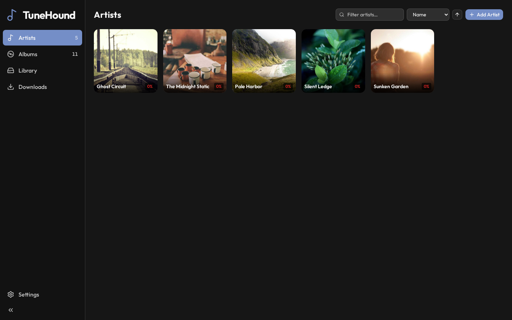
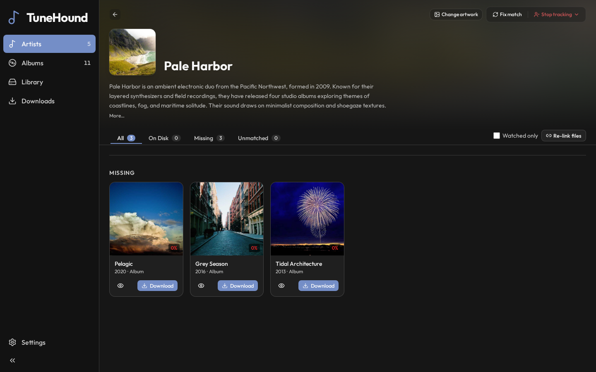
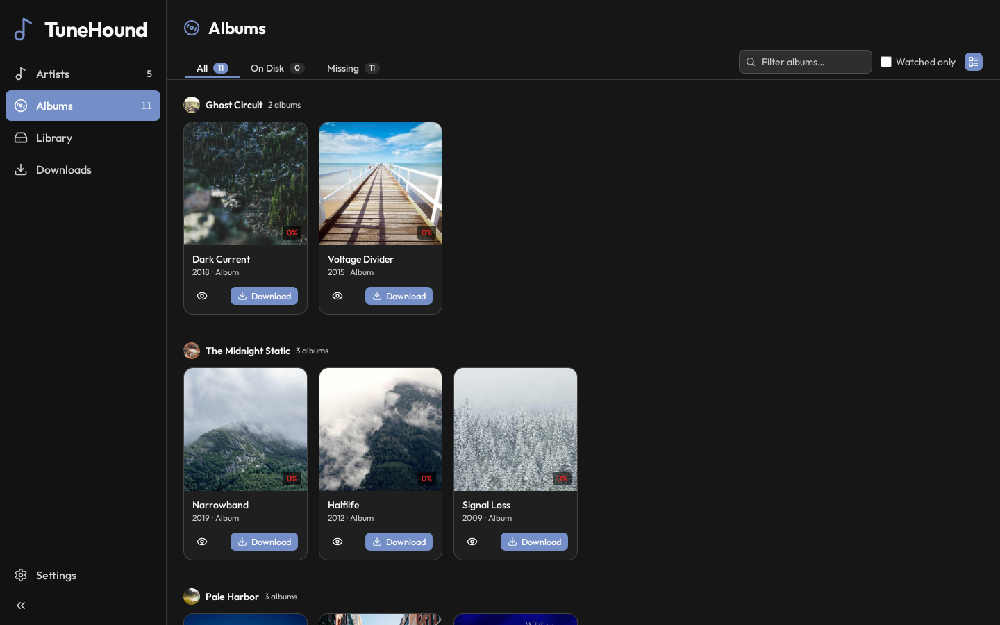
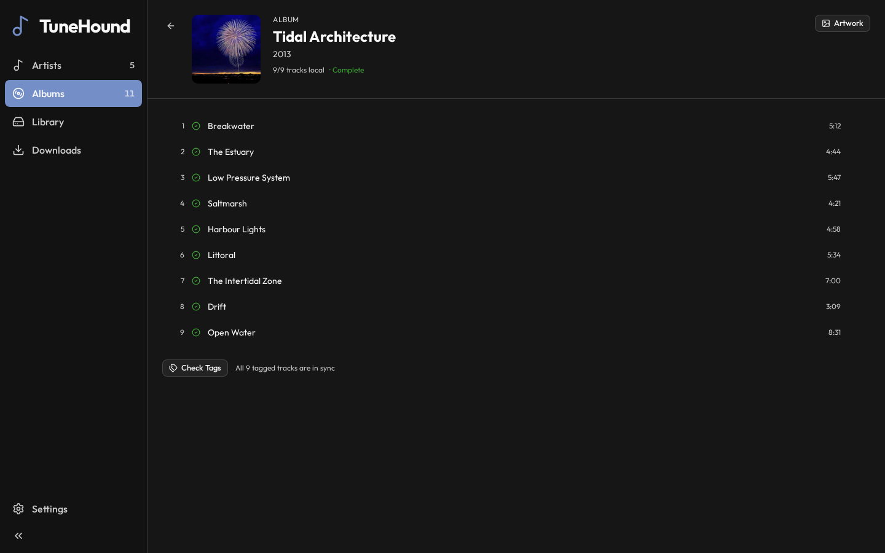
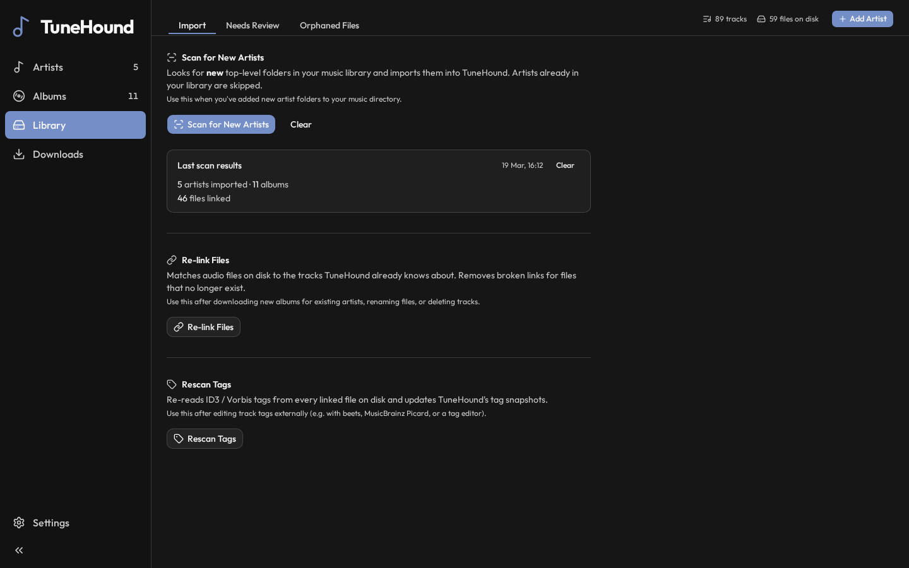
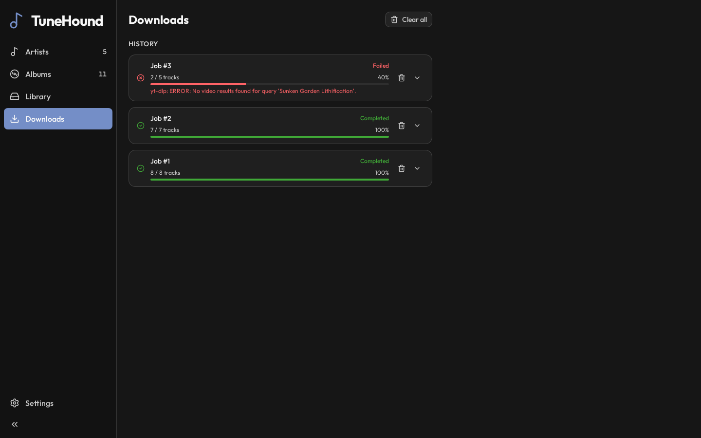

# TuneHound

Self-hosted music library manager. Subscribe to artists, automatically discover their discography via MusicBrainz, download audio from YouTube with yt-dlp, and keep your local library organized and tagged.

TuneHound touches on features you see in MusicBrainz Picard and Lidarr, with a tighter focus on:
* Library maintenance: Tagging your music library (text metadata and artwork)
* Library completeness: Downloading (via yt-dlp) for missing artists, albums, _or_ tracks

TuneHound has limited write ability. It can write new tags and artwork to your existing music, download new tracks, and in limited scenarios, delete. The goal is to keep the music library clean and complete without letting you accidentally blow shit up.

## Features

- Subscribe to artists and track their full discography (albums, EPs, singles)
- Match existing local folders to MusicBrainz releases on import
- Article-aware MusicBrainz scoring ("The Watchmen" won't match "The Beatles")
- Prompt to rename artist folders to their canonical form during import
- Download albums or individual tracks from YouTube
- Real-time download progress via WebSocket
- Tag files with full MusicBrainz metadata (recording, release group, and artist MBIDs) and Cover Art Archive artwork
- MBIDs are written to tags so files can be precisely re-linked after a rescan
- Browse your library by artist or album with cover art
- Re-link Files: reconnect audio files to library entries after moving or renaming them on disk
- Rescan Tags: refresh ID3/Vorbis tag snapshots from the latest file metadata
- Orphaned file detection: find audio files on disk that aren't linked to any library entry, grouped by artist folder
- SponsorBlock support, cookies for YouTube Premium, proxy support


## Screenshots








## Is this AI slop?

Yes. Don't use it.


## Quick Start

Create a `.env` file:

```env
MUSIC_DIR=/path/to/your/music
PORT=8000
```

Then run:

```bash
docker compose up -d
```

Open `http://localhost:8000`.

## Installing in Docker

TBD


## Configuration

### Environment Variables

| Variable | Default | Description |
|----------|---------|-------------|
| `MUSIC_DIR` | `/music` | Path to your music directory on the host |
| `PORT` | `8000` | Host port to expose the UI |

### Application Settings

All other settings are configured via the **Settings** page in the UI and stored in the database.

**Library & Metadata**

| Setting | Description |
|---------|-------------|
| Album languages | ISO 639-3 language codes to filter releases (e.g. `eng`) |
| Release types | Which release types to track: albums, EPs, singles, broadcasts |
| Min import confidence | MusicBrainz match score threshold (0–100) for bulk library import |

**Downloads**

| Setting | Description |
|---------|-------------|
| Audio format | Output codec: `opus`, `vorbis`, `mp3`, `flac`, `m4a` |
| yt-dlp format | Format selector passed to yt-dlp (presets or custom string) |
| Delay between tracks | Random delay range (seconds) between downloads to avoid rate limits |
| Max retries | Retry attempts per failed track |
| Concurrent fragments | Parallel fragment downloads for DASH/HLS streams |
| Rate limit | Bytes/sec cap (0 = unlimited) |
| Cookies file | Path to a Netscape-format `cookies.txt` for YouTube Premium auth |
| Proxy | SOCKS5 proxy URL |
| Geo-bypass | Enable yt-dlp geo-restriction bypass |
| Search results | Number of YouTube results to try per track (1–10) |
| Search query template | Template with `{artist}`, `{title}`, `{album}` variables |

**SponsorBlock**

Select which SponsorBlock categories to remove from downloaded audio: `music_offtopic`, `sponsor`, `intro`, `outro`, `selfpromo`, `interaction`.

## YouTube Premium / Cookies

To download at higher quality or access region-restricted content, provide a `cookies.txt` in Netscape format (exported from a logged-in YouTube session using a browser extension).

Mount it into the container:

```yaml
# docker-compose.yml
volumes:
  - ./cookies.txt:/data/cookies.txt:ro
```

Then set the cookies file path to `/data/cookies.txt` in Settings → Downloads.

## Development

Requires Python 3.11+, Node 22+, and ffmpeg.

```bash
./dev.sh
```

This starts a tmux session with the backend (port 8000, hot-reload) and frontend dev server (port 5173) in separate windows.

Cheat sheet:
ctrl-b, n - Go to next terminal
ctrl-b, d - Detach your terminal from the session but keep it running
`tmux a` - Reattach your terminal to the session
ctrl-b, R - (that's shift-r) Restart both servers. Will apply migrations if new ones exist.

## Stack

- **Backend**: Python, FastAPI, SQLAlchemy (async), SQLite, Alembic, yt-dlp
- **Frontend**: React 19, TypeScript, Vite, TanStack Query, Tailwind CSS 4
- **Metadata**: MusicBrainz, Cover Art Archive, TheAudioDB
